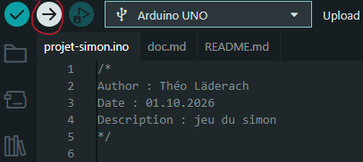
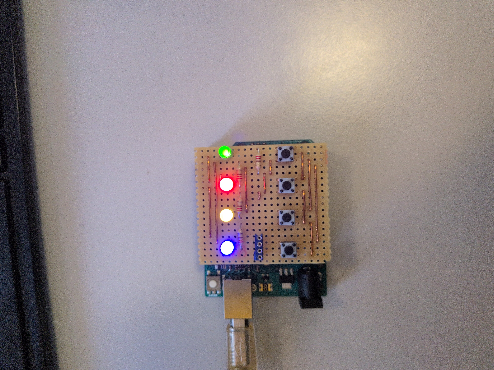

# Projet embarqué | Jeu du Simon

Pour le cours de projet embarqué, nous avons dû recréer le jeu du Simon avec un Arduino.

Voici mon programme avec sa [documentation technique](doc.md).

## Installation :

### 1. Cloner le dépôt Git
  ``` bash
  git clone https://github.com/pj43svh/projet-simon.git
  ```

### 2. Ouvrir le fichier [projet-simon.ino](projet-simon.ino)
Utilisez un IDE capable de compiler le code pour un Arduino *(par exemple : [Arduino IDE](https://docs.arduino.cc/software/ide/))*.
### 3. Installer les bibliothèques
Pour faire fonctionner le code, vous aurez besoin de la librairie suivante et devrez l’installer dans votre IDE :

  * [Bounce2](https://github.com/thomasfredericks/Bounce2)

### 4. Compiler le code
Sélectionnez la bonne carte, puis compilez le programme.



### 5. Jouer
Si la compilation s’est passée sans erreur, vous devriez pouvoir jouer au jeu du Simon ! Appuyez sur le bouton situé sous la LED bleue pour commencer la partie.



## Crédits

Dédicace à moi-même → [mon GitHub](https://github.com/pj43svh/)